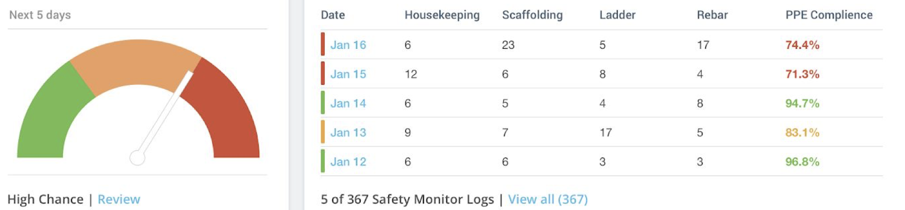

# A.I. In Construction Managment

## Overview and Origin

[Autodesk](https://www.autodesk.com/company) is a Fortune 500 company founded in 1982 by Dan Drake and Jon Walker. Autodesk was imagined by the development of software known as AutoCAD which helped with the visualization of infrastructure design and construction. This software created a more collaborative construction environment that greatly reduced overall construction times. Autodesk over the years has developed many other product lines and software that help with everything from architect design assistance to building management post-construction. Autodesk is currently led by CEO, Andrew Anagost, who with his team, continues to develop more groundbreaking software frequently. This report will focus mainly on the BIM and collaboration side of Autodesk due to the implementation of A.I. and M.L. in these sectors. 

## Business Activities

 Initially, AutoCAD was used to create 2D models of architectural drawings. Through the years AutoCAD continued to develop, implementing 3D models, a user-friendly interface, and cloud integration. In 2020 AutoCAD began implementing generative design A.I. and Machine Learning within the program. They are actively developing and adding to the data used for these new systems through internal and customer data analysis.  
 With that being said, Currently, you can generate a complete set of infrastructure plans and 3D models with a list of commands. Then the software can recommend certain sustainability efforts/materials to use, and flag any issues with the internal plumbing, electrical, or HVAC systems that would usually only come up once construction is underway. All this is extremely helpful for boosting productivity especially when paired with another Autodesk software known as Revit.  
 Revit is one of Autodesk’s BIM (Building Information Modeling) softwares that helps with the collaboration of all different trades on a construction site. The BIM software segment of Autodesk is intended for planning and construction; this would include Architects, Engineers, and Contractors. The global market for BIM solutions is currently estimated at 8 billion USD and is expected to grow to 14.8 billion USD. Autodesk Revit holds 40% of that global market share. Due to its major market share, Autodesk’s BIM software has a competitive advantage that can be leveraged to develop A.I. tools faster and more efficiently because of the availability of more data points and history to analyze.  
 

 Autodesk notes that they plan to implement computer vision AI within this BIM software to ensure a safer and more productive work site. An example of this would be cameras set up around the site to ensure trade workers have all their required PPE equipped; If someone is flagged for not wearing an item like gloves the project manager gets notified. As this technology develops with more and more data Autodesk believes they will be able to predict when incidents are more likely to happen helping to prevent them in the future.  

Currently, AutoCADs most used application is Python and their most used DevOps is Git. Along with this AutoCAD also use the bellow table list:

| Applications                     | DevOps                          |
|---------------------------------|---------------------------------|
| Java                            | Jenkins                          |
| NGINX                            | New Relic                        |
| PostgreSQL                       |                                 |
| Redis                            |                                 |
| Django                           |                                 |
| Apache Tomcat                    |                                 |
| Other Amazon services            |                                 |

## Landscape

Autodesk develops software programs focused on design, engineering, and collaboration for the construction of infrastructure. Within this field, there have been countless trends and innovations within the last 5 years. Most of the innovations are more related to hardware such as VR safety goggles that allow you to see site drawings on the field while doing work. Every month there seems to be a new promise of some type of revolutionary technology for the world of construction that later gets unrealized due to cost issues both for production and for implementation. Autodesk and other software developers aim to achieve these types of hardware benefits without the long-term costs of implementation. 
 
 

*Autodesks Competitors:*

* Bentley Systems (civil projects)
* Trimble (Tekla Structure)
* Graphisoft (Design/ architect focused) 

Autodesk’s biggest competitor is Bentley Systems which specializes in BIM services for civil projects like roads. Bentley Systems is known for its ability to manage very large-scale civil projects due to more freedoms in the system for organizational practices. Although this could be preferred for some general contractors it dampens Bentley Systems’ ability to implement specialized A.I. knowledge like Autodesk should be able to. 

## Results

* What has been the business impact of this company so far?

* What are some of the core metrics that companies in this field use to measure success? How is your company performing based on these metrics?

* How is your company performing relative to competitors in the same field?

## Recommendations

* If you were to advise the company, what products or services would you suggest they offer? (This could be something that a competitor offers, or use your imagination!)

* Why do you think that offering this product or service would benefit the company?

* What technologies would this additional product or service utilize?

* Why are these technologies appropriate for your solution?# ai-case-study

[def]: https://www.autodesk.com/company
[def2]: Desktop/Activites/ai-case-study/Data.png